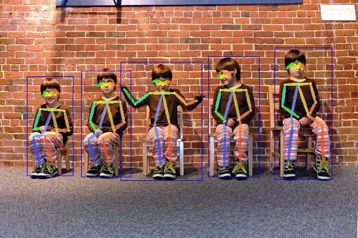

## 1. Requirements
* CUDA 11.1
* TensorRT 7.2.2
* Python 3.8.5
* Cython
* PyTorch 1.8.1
* torchvision 0.9.1
* numpy 1.17.4 (numpy版本过高会出报错 [this issue](https://github.com/MVIG-SJTU/AlphaPose/issues/777) )
* python-package setuptools >= 40.0, reported by [this issue](https://github.com/MVIG-SJTU/AlphaPose/issues/838)

## 2. Results
[AlphaPose](https://github.com/MVIG-SJTU/AlphaPose/blob/master/docs/MODEL_ZOO.md) 存在多个目标检测+姿态估计模型的组合，
本仓库(fork from [AlphaPose](https://github.com/MVIG-SJTU/AlphaPose) )仅对[YOLOv3_SPP](https://raw.githubusercontent.com/AlexeyAB/darknet/master/cfg/yolov3-spp.cfg) + [Fast Pose](https://github.com/MVIG-SJTU/AlphaPose/blob/master/configs/coco/resnet/256x192_res50_lr1e-3_1x.yaml)
进行加速。
<div align="center">
    <br>
    <b><a>AlphaPose_trt inference rst</a></b>
</div>
AlphaPose在数据预处理部分使用YOLOv3-SPP模型检测出一幅图像中的多个人物，然后将这些人物图像送入到FastPose模型中进行姿态估计。
我们对YOLOv3_SPP模型以及FastPose模型都进行了加速， 并记录了加速前后的mAP值 (COCO val 2017， Tesla T4)。 其中ground truth box表示FastPose模型
的检测精度， detection boxes表示YOLOv3_SPP + FastPose模型的检测精度。
<center>

| Method | ground truth box mAP@0.6 | detection boxes mAP@0.6 | 
|:-------|:-----:|:-------:|
| AlphaPose | 0.743 |0.718 | 
| **AlphaPose_trt** | **0.743** | **0.718** |

</center>


**所有的测试过程都对GPU以及Memory进行了锁频**

GPU Frequency = **1509HZ**, Memory Frequency = **5001HZ**，具体操作如下：

```shell 
nvidia-smi -pm 1
nvidia-smi -q -d clock  # 查看memory以及gpu的频率
nvidia-smi -ac memoryFrq, gpuFrq
nvidia-smi -lgc gpuFrq,gpuFrq   # 将GPU进行锁频

```

### 2.1 YOLOv3-SPP speed up
下表记录了YOLOv3_SPP模型在不同batch size下的推理时间以及吞吐量，并计算了加速比(第三列以及第四列)。


吞吐量Throughput = 1000 / latency * batchsize

Latency speed up = original latency / trt latency
<center>

| model | Batchsize | Latency (ms) | Throughput  | Latency Speedup |Throughput speedup|
|:-------|:-----:|:-------:|:-----:|:-------:|:-------:|
| YOLOv3-SPP | 1 | 54.1 | 18.48 |  |  |
|  | 2 | 93.9 | 21.30 |  |  |
|  | 4 | 172.6 | 23.17 |  |  |
|  | 8 | 322.8 | 24.78 |  |  |
| **YOLOv3-SPP_trt** | 1 | 20.1 | 49.75 | **2.7x** | **2.7x** |
|  | 2 | 33.7 | 59.35 | **2.8x** | **2.8x** |
|  | 4 | 60.5 | 66.12 | **2.9x** | **2.9x** |
|  | 8 | 115.5 | 69.26 | **2.8x** | **2.8x** |


</center>
代码实现参考8.2部分

### 2.2 Fast Pose speed up
下表记录了Fast Pose模型在不同batch size下的推理时间以及吞吐量，并计算了加速比(第三列以及第四列)。
<center>

| model | Batchsize | Latency (ms) | Throughput  | Latency Speedup |Throughput speedup|
|:-------|:-----:|:-------:|:-----:|:-------:|:-------:|
| FastPose | 1 | 23.9 | 41.84 |  |  |
|  | 2 | 24.6 | 81.30 |  |  |
|  | 4 | 27.9 | 143.37 |  |  |
|  | 8 | 33.2 | 240.96 |  |  |
|  | 16 | 56.6 | 282.68 |  |  |
|  | 32 | 105.8 | 302.46 |  |  |
|  | 64 | 206.2 | 310.38 |  |  |
| **FastPose_trt** | 1 | 1.49 | 671.14 | **16.0x** | **16.0x** |
|  | 2 | 2.32 | 862.07 | **10.6x** | **10.6x** |
|  | 4 | 4.06 | 985.22 | **6.9x** | **6.9x** |
|  | 8 | 7.69 | 1040.31 | **4.3x** | **4.3x** |
|  | 16 | 15.16 | 1055.41 | **3.7x** | **3.7x** |
|  | 32 | 29.98 | 1067.38 | **3.5x** | **3.5x** |
|  | 64 | 59.67 | 1072.57 | **3.5x** | **3.5x** |

</center>
代码实现参考8.1部分

### 2.3 YOLOv3-SPP + FastPose speed up
下表记录了YOLOv3_SPP + FastPose模型在不同batch size下的推理时间以及吞吐量，并计算了加速比(第三列以及第四列)。

<center>

| model | Batchsize | Latency (ms) | Throughput  | Latency Speedup |Throughput speedup|
|:-------|:-----:|:-------:|:-----:|:-------:|:-------:|
| AlphaPose | 1 | 78.0 | 12.82 |  |  |
|  | 2 | 118.5 | 16.87 |  |  |
|  | 4 | 200.5 | 19.95 |  |  |
|  | 8 | 356 | 22.47 |  |  |
| **AlphaPose_trt** | 1 | 21.59 | 46.32 | **3.6x** | **3.6x** |
|  | 2 | 36.02 | 55.52 | **3.3x** | **3.3x** |
|  | 4 | 64.56 | 61.96 | **3.1x** | **3.1x** |
|  | 8 | 123.19 | 64.94 | **3.5x** | **3.5x** |

</center>
代码实现参考8.3部分

## 3. Code installation
   AlphaPose的安装参考自[这](https://github.com/MVIG-SJTU/AlphaPose/blob/master/docs/INSTALL.md)
，主要有两种安装方式
#### 3.1 使用conda进行安装

Install conda from [here](https://repo.anaconda.com/miniconda/)
```shell
# 1. Create a conda virtual environment.
conda create -n alphapose python=3.6 -y
conda activate alphapose

# 2. Install PyTorch
conda install pytorch==1.1.0 torchvision==0.3.0

# 3. Get AlphaPose
git clone https://github.com/MVIG-SJTU/AlphaPose.git
# git pull origin pull/592/head if you use PyTorch>=1.5
cd AlphaPose


# 4. install
export PATH=/usr/local/cuda/bin/:$PATH
export LD_LIBRARY_PATH=/usr/local/cuda/lib64/:$LD_LIBRARY_PATH
python -m pip install cython
sudo apt-get install libyaml-dev
################Only For Ubuntu 18.04#################
locale-gen C.UTF-8
# if locale-gen not found
sudo apt-get install locales
export LANG=C.UTF-8
######################################################
python setup.py build develop
```

#### 3.2 使用pip进行安装
```shell
# 1. Install PyTorch
pip3 install torch==1.1.0 torchvision==0.3.0

# Check torch environment by:  python3 -m torch.utils.collect_env

# 2. Get AlphaPose
git clone https://github.com/MVIG-SJTU/AlphaPose.git
# git pull origin pull/592/head if you use PyTorch>=1.5
cd AlphaPose

# 3. install
export PATH=/usr/local/cuda/bin/:$PATH
export LD_LIBRARY_PATH=/usr/local/cuda/lib64/:$LD_LIBRARY_PATH
pip install cython
sudo apt-get install libyaml-dev
python3 setup.py build develop --user
```

## 4. YOLOv3-SPP(PyTorch) to engine
YOLOv3-SPP(PyTorch)可以转成static shape的engine模型以及dynamic shape的engine模型。前者表示engine的输入数据只能是
固定的尺寸，而后者表示我们输入的数据尺寸可以是动态变化的，但是变化的范围要在我们转成engine时所设置的范围内。


### 4.1 转成static shape的engine模型
(1) YOLOv3_SPP转成onnx模型

下载YOLOv3_SPP的[cfg](https://raw.githubusercontent.com/AlexeyAB/darknet/master/cfg/yolov3-spp.cfg) 以及[weights](https://pjreddie.com/media/files/yolov3-spp.weights) ，并分别放在
./detector/yolo/cfg/以及./detector/yolo/data/文件夹下。
YOLOv3_SPP输入数据的尺寸默认为: 1x3x608x608


``` shell
python ./darknet2onnx.py 
--cfg ./detector/yolo/cfg/yolov3-spp.cfg 
--weight ./detector/yolo/data/yolov3-spp.weights
```
执行该命令之后，会在当前目录下产生一个yolov3_spp_static.onnx模型

(2) 对模型进行修正

由于YOLOv3-SPP模型中存在Padding操作，trt不能直接识别，因此需要onnx进行修改 [this issue](https://github.com/onnx/onnx-tensorrt/blob/master/docs/faq.md#inputsat0-must-be-an-initializer-or-inputsat0is_weights
)。可能需要额外下载tensorflow-gpu == 2.4.1以及polygraphy == 0.22.0模块。
``` shell
polygraphy surgeon sanitize yolov3_spp_static.onnx 
--fold-constants 
--output yolov3_spp_static_folded.onnx
```
执行该命令之后，会在当前目录下产生一个yolov3_spp_static_folded.onnx模型

(3) 由onnx模型生成engine

需要注册ScatterND plugin，将[this repository](https://github.com/NVIDIA/trt-samples-for-hackathon-cn/tree/master/plugins)
下的plugins文件夹以及Makifile文件放到当前目录下，然后make MakeFile文件，进行编译，编译之后会在build文件夹下产生
一个ScatterND.so动态库。
``` shell 
trtexec --onnx=yolov3_spp_static_folded.onnx 
--explicitBatch 
--saveEngine=yolov3_spp_static_folded.engine 
--workspace=10240 --fp16 --verbose 
--plugins=build/ScatterND.so
```
执行该命令之后，会在当前目录下产生一个yolov3_spp_static_folded.engine模型

### 4.2 转成dynamic shape的engine模型
(1)  YOLOv3_SPP模型转成onnx模型

输入数据的默认尺寸为: -1x3x608x608 (-1表示batch size可变)
``` shell
python darknet2onnx_dynamic.py 
--cfg ./detector/yolo/cfg/yolov3-spp.cfg 
--weight ./detector/yolo/data/yolov3-spp.weights
```
执行该命令之后，会在当前目录下产生一个yolov3_spp_-1_608_608_dynamic.onnx模型

(2) 对onnx模型就行修改
``` shell
polygraphy surgeon sanitize yolov3_spp_-1_608_608_dynamic.onnx 
--fold-constants 
--output yolov3_spp_-1_608_608_dynamic_folded.onnx
```

(3) 由onnx模型转成engine

minShapes设置能够输入数据的最小尺寸，optShapes可以与minShapes保持一致，maxShapes设置输入数据的最大尺寸，这三个是必须要设置的，可通过trtexec -h查看具体用法。
转换模型的时候一定需要将ScatterND.so动态库进行加载，不然可能会报该plugin无法识别的错误。
``` shell
trtexec --onnx=yolov3_spp_-1_608_608_dynamic_folded.onnx 
--explicitBatch 
--saveEngine=yolov3_spp_-1_608_608_dynamic_folded.engine 
--workspace=10240 --fp16 --verbose 
--plugins=build/ScatterND.so 
--minShapes=input:1x3x608x608 
--optShapes=input:1x3x608x608 
--maxShapes=input:64x3x608x608 
--shapes=input:1x3x608x608
```
执行该命令之后，会在当前目录下产生一个yolov3_spp_-1_608_608_dynamic_folded.engine 模型(之后
我们可以传入不同batch size的输入数据进行推理)

## 5. FastPose(PyTorch) to engine
### 5.1 生成static shape的engine模型
(1) FastPose转成onnx模型

模型输入数据的默认尺寸为: 1x3x256x192
``` shell
python pytorch2onnx.py --cfg ./configs/coco/resnet/256x192_res50_lr1e-3_1x.yaml 
--checkpoint ./pretrained_models/fast_res50_256x192.pth
```
执行完该指令之后，会在当前目录下生成一个fastPose.onnx模型

(2) onnx转成engine模型
```shell
trtexec trtexec --onnx=fastPose.onnx 
-saveEngine=fastPose.engine --workspace=10240 
--fp16 
--verbose
```
执行该命令之后，会在当前目录下生成一个fastPose.engine模型

### 5.2 生成dynamic shape的engine模型
(1) 生成onnx模型

模型输入数据的默认尺寸为：-1x3x256x192 (-1表示batch size可变)
```shell
python pytorch2onnx_dynamic.py 
--cfg ./configs/coco/resnet/256x192_res50_lr1e-3_1x.yaml 
--checkpoint ./pretrained_models/fast_res50_256x192.pth
```
执行该命令之后，会在当前目录下生成一个alphaPose_-1_3_256_192_dynamic.onnx模型

(2) onnx模型转成engine模型
```shell 
trtexec --onnx=alphaPose_-1_3_256_192_dynamic.onnx 
--saveEngine=alphaPose_-1_3_256_192_dynamic.engine 
--workspace=10240 --fp16 --verbose 
--minShapes=input:1x3x256x192 
--optShapes=input:1x3x256x192 
--maxShapes=input:128x3x256x192 
--shapes=input:1x3x256x192 
--explicitBatch
```
执行该命令之后，会在当前目录下生成一个alphaPose_-1_3_256_192_dynamic.engine模型

上面的所有模型都可以从[baidu Pan](https://pan.baidu.com/s/13z0aY0LhetgJn6U23tY1wQ) 获取(提取码: cumt)

## 6. Inference
这一部分主要使用加速前后的模型对图像以及视频进行检测
### 6.1 对图像进行检测
将图像放在example/demo文件夹下，然后执行下面的指令，检测结果将保存在examples/res/vis文件夹下

(1) 使用未加速模型对图像进行检测
```shell
python inference.py --cfg ./configs/coco/resnet/256x192_res50_lr1e-3_1x.yaml 
--checkpoint ./pretrained_models/fast_res50_256x192.pth  
--save_img  --showbox 
--indir ./examples/demo
```

(2) 使用tensorRT加速模型对图像进行检测
```shell
python trt_inference.py 
--yolo_engine ./yolov3_spp_static_folded.engine 
--pose_engine ./fastPose.engine 
--cfg ./configs/coco/resnet/256x192_res50_lr1e-3_1x.yaml 
--save_img  
--indir ./examples/demo 
--dll_file ./build/ScatterND.so
```
如果希望检测结果对人体进行目标检测，可以加上--showbox

### 6.2 对视频进行检测
将视频放在video文件夹下，推理的结果将保存在examples/res文件夹下

(1) 使用未加速模型对视频进行检测
```shell
python inference.py --cfg ./configs/coco/resnet/256x192_res50_lr1e-3_1x.yaml
--checkpoint ./pretrained_models/fast_res50_256x192.pth 
--save_video
--video ./videos/demo.avi
```

(2) 使用tensorRT加速模型对视频进行检测
```shell
python trt_inference.py --yolo_engine ./yolov3_spp_static_folded.engine
--cfg ./configs/coco/resnet/256x192_res50_lr1e-3_1x.yaml
--save_video
--video ./videos/demo_short.avi 
--dll_file ./build/ScatterND.so
--pose_engine ./fastPose.engine 
--detector yolo
```
注意：在对视频的检测过程中，如果使用加速的YOLOv3_SPP模型会产生bug，因为这里使用未加速的YOLOv3_SPP
模型，在后续的工作中会针对该bug对程序进行改进。其中--detector yolo表示使用未加速的YOLOv3_SPP模型，--detector yolo_trt表示使用加速的YOLOv3_SPP模型

## 7. Validation
该部分使用加速前后的模型对MSCOCO 2017的验证集[val2017](https://cocodataset.org/#keypoints-2017) 进行测试。
将annotations以及val207放到data/coco文件夹下。
 
 (1) 使用未加速的模型进行验证
 ```shell
python validate.py --cfg ./configs/coco/resnet/256x192_res50_lr1e-3_1x.yaml 
--checkpoint ./pretrained_models/fast_res50_256x192.pth  
--flip-test
--detector yolo
```

(2) 使用加速的模型进行验证
```
python validate_trt.py --cfg ./configs/coco/resnet/256x192_res50_lr1e-3_1x.yaml 
--pose_engine ./fastPose.engine 
--yolo_engine ./yolov3_spp_static_folded.engine 
--dll_file ./build/ScatterND.so 
--flip-test
--detector yolo_trt
```
## 8. Speed Up Validation
### 8.1 FastPose模型加速效果验证
可以使用下面命令对FastPose人体姿态检测模型的加速效果进行验证，这里使用的是dynamic shape的engine进行推理。
```shell
python demo_trt_fastpose.py 
--cfg ./configs/coco/resnet/256x192_res50_lr1e-3_1x.yaml 
--checkpoint ./pretrained_models/fast_res50_256x192.pth 
--engine_path ./alphaPose_-1_3_256_192_dynamic.engine --batch 1
```
### 8.2 YOLOv3_SPP模型加速效果验证
可以使用下面命令对YOLOv3_SPP人体目标检测的加速效果进行验证。
```shell
python demo_trt_yolov3_spp.py --cfg ./detector/yolo/cfg/yolov3-spp.cfg 
--weight ./detector/yolo/data/yolov3-spp.weights 
--engine_path ./yolov3_spp_-1_608_608_dynamic_folded.engine
--batch 1
```

### 8.3 AlphaPose(YOLOv3_SPP + FastPose)
可以使用下面命令对AlphaPose模型的加速效果进行验证。
```
python demo_trt_alphapose.py 
--fastpose_cfg ./configs/coco/resnet/256x192_res50_lr1e-3_1x.yaml
--yolo_cfg ./detector/yolo/cfg/yolov3-spp.cfg
--weight ./detector/yolo/data/yolov3-spp.weights
--checkpoint ./pretrained_models/fast_res50_256x192.pth
--fastpose_engine ./alphaPose_-1_3_256_192_dynamic.engine
--yolo_engine ./yolov3_spp_-1_608_608_dynamic_folded.engine
--batch 1
```

## 9. TODO
- [ ] 目标检测使用轻量级网络(YOLOv3-tiny, YOLOv4_tiny等)
- [ ] 使用numpy+pycuda进行推理加速
- [ ] 模型蒸馏
- [ ] 模型剪枝
- [ ] 使用C++的API实现TensorRT加速


## 10. Citation
Please cite these papers in your publications if it helps your research:

    @inproceedings{fang2017rmpe，
      title={{RMPE}: Regional Multi-person Pose Estimation}，
      author={Fang， Hao-Shu and Xie， Shuqin and Tai， Yu-Wing and Lu， Cewu}，
      booktitle={ICCV}，
      year={2017}
    }

    @article{li2018crowdpose，
      title={CrowdPose: Efficient Crowded Scenes Pose Estimation and A New Benchmark}，
      author={Li， Jiefeng and Wang， Can and Zhu， Hao and Mao， Yihuan and Fang， Hao-Shu and Lu， Cewu}，
      journal={arXiv preprint arXiv:1812.00324}，
      year={2018}
    }

    @inproceedings{xiu2018poseflow，
      author = {Xiu， Yuliang and Li， Jiefeng and Wang， Haoyu and Fang， Yinghong and Lu， Cewu}，
      title = {{Pose Flow}: Efficient Online Pose Tracking}，
      booktitle={BMVC}，
      year = {2018}
    }


## 11. Reference

(1) [AlphaPose](https://github.com/MVIG-SJTU/AlphaPose)

(2) [trt-samples-for-hackathon-cn](https://github.com/NVIDIA/trt-samples-for-hackathon-cn)

(3) [pytorch-YOLOv4](https://github.com/Tianxiaomo/pytorch-YOLOv4)

(4) [darknet](https://github.com/AlexeyAB/darknet)
